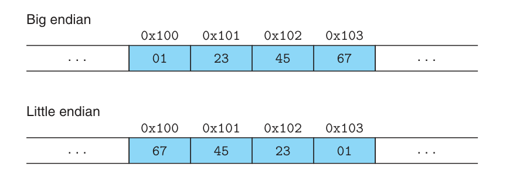

## 2.1. Information Storage
- Every byte of memory is identified by a unique number, known as it's address.
- Set of all possible addresses is known as virtual address space
- The actually implementation use a combination of DRAM, flash memory, disk storage, special hardware...
- The value of a pointer in C is the virtual address of the first byte of some block storage (type-agnostic)
- The actually machine-level program has no info about data types
- There is a lot of standards for C, we focus on the latest (ISO C11)
- `gcc -std=c11 prog.c`
- Every computer has a word size (32 bits, 64 bits, ...)
- For a machine with a w-bit word size, the virtual addresses can range from 0->2^w-1, giving the program at most 2^w bytes
- We should use data types where data sizes are fixed int32_t, int64_t
- Pointer uses the full word size of the program
- In virtually all machines, a multi-byte object is stored as a contiguous sequence of bytes. The address of that object is the smallest address of the bytes used
- Assume variable x has type int and int size is 4 bytes. Let's say &x return 0x100 this means the 4 bytes of x would be stored at: 0x100, 0x101, 0x102, 0x103
- There are two byte-ordering in CS:
    - Little endian: least significant byte comes first
    - Big endian: most significant byte comes first
    - Suppose variable int x has value of 0x1234567, then it's representation in both types is:
    
- Byte ordering becomes fixed once a particular OS is chosen (most chip can be confitured to operate as either big or little endian (bi-endian))
- Both type of ordering are equally good, we only care about byte ordering when binary data are communicate over a network of machines
## 2.2 Integer representation
- Let assume an integer data type of w bits
- Unsigned encoding: 
## 2.4 Floating Point
