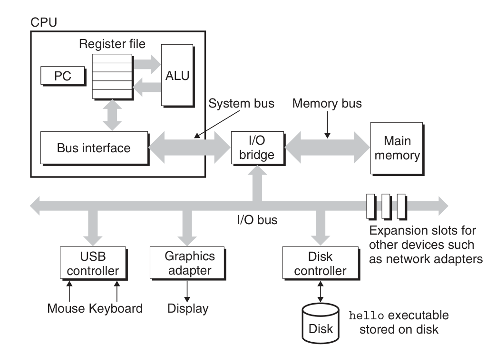
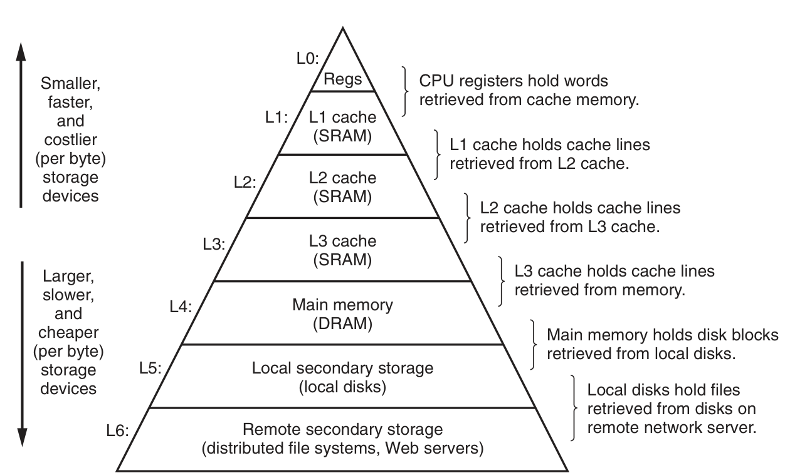
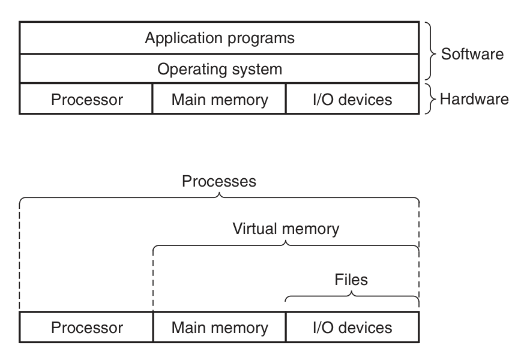

- every file is a sequence of bytes
- programs are translated by other programs into different forms
- Four phase of compilation system:
    - Preprocessing: modifies the original C program according to directives that begin with the ‘#’ character -> hello.i
    - Compilation: translate hello.i to assembly language: hello.s
    - Assembly: translate hello.s to machine-language instructions, packages them to an object program -> hello.o (binary file)
    - Linking: merge codes from our from to other library (std or other installed libs) -> hello.exe
- Hardware organization of a System

    - Bus: electrical conduits that carry bytes of information between components. Typically designed to transfer fixed-size chunks of bytes known as words (mostly 4 bytes (32 bits) or 8 bytes)
    - I/O devices: help system connect to the outside world, this could includes keyboard, mouse, speaker, disk drive...
    - I/O device is connected to the I/O bus by either a controlelr or adapter.
        - Controller: chipset in the device itself or stay in the motherboard
        - Adapter: a card that plugs into a slot on the motherboard
    - Main memory: a collection of dynamic random access memory chips
    - Processor: also known as CPU, executes instructions stored in main memory, includes a word-size storage device (register) called PC (program counter)
- Running the program: 
    - the shell program is executing its instructions, waiting for us to type a command
    - As we type the characters ./hello at the keyboard, the shell program reads each one into a register and then stores it in memory
    - we hit enter, shell knows we have finished typing, it then load the executable hello from disk to main memory
    - the processor then begin executing the machine-language instructions in the hello program’s main routine
- Cache: systems spend a lot of time moving information from one place to another (disk -> memory -> register -> display device)
- Due to physical laws, larger storage devices are slower than smaller storage devices (10-1000 times)
- It is easier and cheaper to make processors run faster than it is to make main memory run faster
- To deal with this, we include smaller, faster storage devices called cache memories that serve as temporary staging areas for information that the processor is likely to need in the near future
- This is where the terms L1, L2, L3 come from

- The main idea of cache is that faster storage at one level serves as a cache for slower storage at the next level: Register is cache for L1. And
L1, L2 are cache for L2, L3...
- Programs don't access the process, memory, I/O device directly, they relied on services provided by OS
- OS abstract the system to: processes, virtual memory, and files
