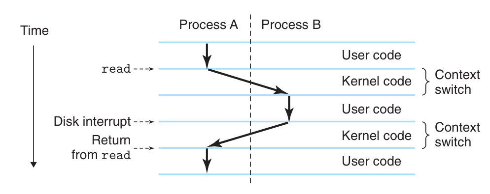
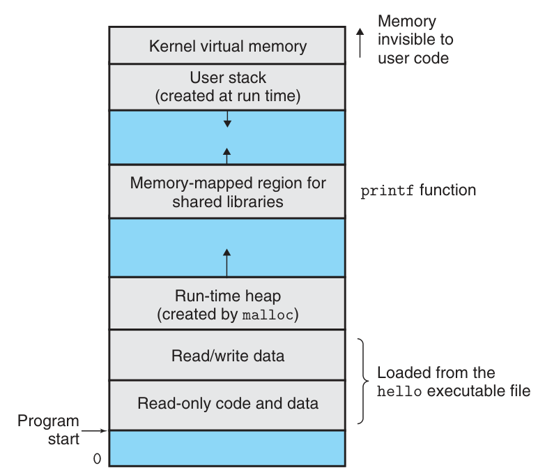
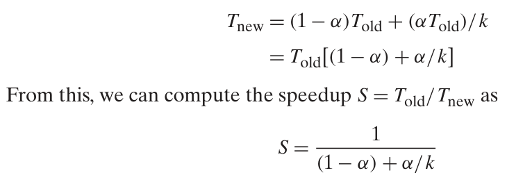

- Programs are translated by other programs into different forms
- Four phase of compilation system:
    - Preprocessing: modifies the original C program according to directives that begin with the ‘#’ character -> hello.i
    - Compilation: translate hello.i to assembly language: hello.s
    - Assembly: translate hello.s to machine-language instructions, packages them to an object program -> hello.o (binary file)
    - Linking: merge codes from our from to other library (std or other installed libs) -> hello.exe
- Hardware organization of a System

    - Bus: electrical conduits that carry bytes of information between components. Typically designed to transfer fixed-size chunks of bytes known as words (mostly 4 bytes (32 bits) or 8 bytes)
    - I/O devices: help system connect to the outside world, this could includes keyboard, mouse, speaker, disk drive...
    - I/O device is connected to the I/O bus by either a controller or adapter.
        - Controller: chipset in the device itself or stay in the motherboard
        - Adapter: a card that plugs into a slot on the motherboard
    - Main memory: a collection of dynamic random access memory chips
    - Processor: also known as CPU, executes instructions stored in main memory, includes a word-size storage device (register) called PC (program counter)
- Running the program: 
    - the shell program is executing its instructions, waiting for us to type a command
    - As we type the characters ./hello at the keyboard, the shell program reads each one into a register and then stores it in memory
    - we hit enter, shell knows we have finished typing, it then load the executable hello from disk to main memory
    - the processor then begin executing the machine-language instructions in the hello program’s main routine
- Cache: systems spend a lot of time moving information from one place to another (disk -> memory -> register -> display device)
- Due to physical laws, larger storage devices are slower than smaller storage devices (10-1000 times)
- It is easier and cheaper to make processors run faster than it is to make main memory run faster
- To deal with this, we include smaller, faster storage devices called cache memories that serve as temporary staging areas for information that the processor is likely to need in the near future
- This is where the terms L1, L2, L3 come from

- The main idea of cache is that faster storage at one level serves as a cache for slower storage at the next level: Register is cache for L1. And
L1, L2 are cache for L2, L3...
- Programs don't access the process, memory, I/O device directly, they relies on services provided by OS
- OS abstract the system to: processes, virtual memory, and files
- Files are abstractions for I/O devices
- Virtual memory is an abstraction for both main memory and disk I/O devices
- Processes are abstractions for the processor, main memory and I/O devices

- The OS provides the illusion that the program is the only one running on the system.
- A process is the OS's abstraction for a running program.
- Multiple processes can run concurrently: the insutrctions of one process are interleaved with instructions of another process.
- The OS make CPU appears to execute multiple processes concurrently using context switching
- Context: current value of PC, register file, contents of main memory
- OS perform context switching by saving the context of the current process, restoring the context of the new process

- The transition from one process to another is managed by the OS kernel: portion of the OS code that is always resident in memory
- When apps require some action by the OS, such that read or write a file, in execute a special system call instruction, transferring control to the kernel -> kernel do it and return back to the app
- Kernel is not a separate process, it's a collection of code and data structures
- Threads: a process can actually consist of multiple execution units called threads that share the same code and global data
- It's easier to share data between thread then processes
- Virtual memory: abstraction that make process thinks it has exclusive use of the main memory

- Files: a sequence of bytes. Every I/O devices are modeled as a file
- Amdahl's Law: when we spped up one part of a system, the effect on the overall system performance depends on both how signifcant this part was and how much it sped up
- Let T_old = old execution time, the current part requires a fraction x of T_old. We improve
- x by a factor of k. It now requires (x.T_old)/k

- Concurrency: a system with multiple, simultaneous tasks/activities
- Parrallelism: the use of concurrency to make a system run faster 